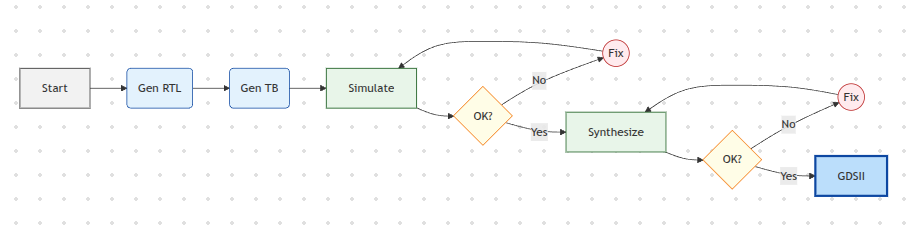

# Chipster: LLM for Chip Design Automation

Chipster is a unified platform that leverages Large Language Models (LLMs) to accelerate the digital, analog, and photonics chip design process. 

For Digital Chip, it encoporates Multi Agent AI with RAG, it integrates two powerful tools:

1.  **Verilog Generator**: Just input your prompt, let say "Quantum Fourier Transform", then it will search codes through the internet (github repos) and local databases. The agents will retrieve and generate verilog codes and pass it to icarus verilog for verification. The agents will loop it back and forth until got synthesizable Verilog, ready for physical design.
2.  **Chip Digital Generator**: Upload the generated RTL, set the desired chip size and number of pinouts, it automatically re-update the RTL to match your needs. Also it integrated with modified OpenLane 2 to perform synthesis, placement, routing. correct Static Timing Analysis (STA) and Antenna Violations. Also the updated RTL also bypassed automatic iverilog verifications too.
3.  **Standard Cell Generator**: OPTIONAL, An AI-powered tool to generate `.mag` physical layout files for standard digital logic cells from simple text prompts.

For Analog Chip, it integrates two powerful tools (Under Construction!!!):

1.  **PySpice AMS & RF Circuit Generator**: Just input your prompt, let say "3 bit flash ADS", then it will search codes through the local databases. The agents will retrieve and generate pyspice codes and pass it to ngspice for verification.
2.  **Chip Analog Generator**: Upload the generated PySpice, it will generate GDS file automatically using GLayout.

For Photonics Chip (Future Works!!!):

### Verilog Generation Workflow


## Demos and Results

### Standard Cell Generator

**Demo Video:**
See how the tool generates a standard cell layout from a simple text prompt in real-time.


**Generated Layout Result:**
Below is the final layout for an OR gate (`my_or.mag`) generated by the tool, including its sub-components.


### Verilog Generator

The Verilog Generator takes a design from a simple prompt all the way to a final GDSII layout. Below is the final chip layout for a generated module after being processed by the OpenLane flow.


## Documentation

For detailed instructions on setup, usage, and architecture, please see our full documentation:

-   [**Documentation Home**](./docs/README.md)
-   [**Verilog Generator Guide**](./docs/verilog_generator.md)
-   [**Standard Cell Generator Guide**](./docs/std_cell_generator.md)

## Quickstart

1.  **Clone the repository:**
    ```bash
    git clone https://github.com/adeirman46/Chipster
    cd Chipster
    ```

2.  **Set up the environment (Digital):**
    Ensure you have Conda, Docker, and Icarus Verilog installed.
    ```bash
    sudo apt install iverilog
    ```
    ```bash
    conda create -n chipster_D python=3.11
    conda activate chipster_D
    pip install -r requirements_digital.txt
    pip install crawl4ai
    crawl4ai-setup
    crawl4ai-doctor
    ```
    Create .env file and enter your Gemini API.
    ```bash
    GOOGLE_API_KEY="YOUR_API"
    ```
    Setup the OpenLane 2 environment.
    ```bash
    python setup_openlane.py
    ```
    Download Faiss Index of Datasets and put this into /data/verilog_datasets from this 

3.  **Set up the environment (Analog):**
    Ensure you have Conda and Docker installed.
    ```bash
    conda create -n chipster_A python=3.11
    conda activate chipster_A
    pip install -r requirements_analog.txt
    ```
    Create .env file and enter your Gemini API.
    ```bash
    GOOGLE_API_KEY="YOUR_API"
    ```
    Setup the OpenLane 2 environment. Just retrieve the PDKs, OpenLane 2 not being used.
    ```bash
    python setup_openlane.py
    ```

4.  **Run the application:**
    Go to src/ then pick folder you want to run, for example, if you want to run the verilog_generator/ then go to the folder and then run the program.
    ```bash
    streamlit run main.py
    ```

## Contributors

### Project Mentor
-   **Prof. Mehdi Saligane** (University of Michigan, Brown University)

### Development Team (Digital)
(Bandung Institute of Technology)
-   Ade Irman Budi Hendriawan
-   Najmi Azzahra
-   William
-   Rifki Afriadi

---
*This project is licensed under the MIT License.*
